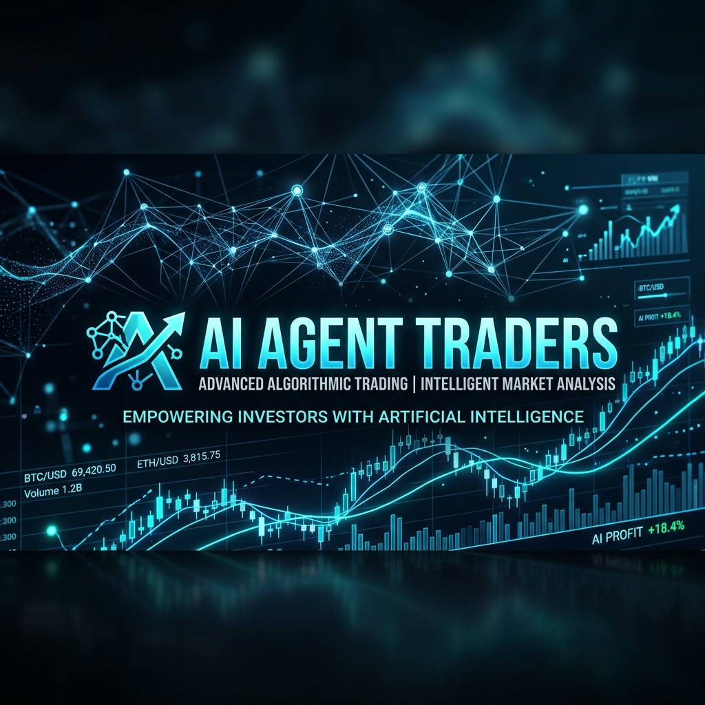
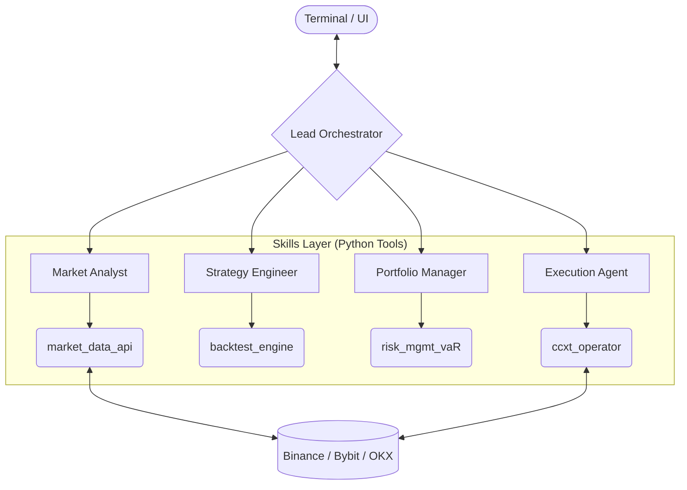

<p align="center">
  
</p>

<h1 align="center">🛡️ AI Agent Traders</h1>

<p align="center">
  <strong>Autonomous Multi-Agent Trading Intelligence System</strong>
</p>

<p align="center">
  <a href="https://opensource.org/licenses/MIT"></a>
  <a href="https://www.python.org/downloads/"></a>
  <a href="https://nodejs.org/"></a>
  <a href="https://github.com/OpenClaw/OpenClaw"></a>
  <a href="#-contributing"></a>
</p>

<p align="center">
  <a href="#-core-features">Features</a> •
  <a href="#-architecture">Architecture</a> •
  <a href="#-quick-start">Quick Start</a> •
  <a href="#-meet-the-team">The Team</a> •
  <a href="#-security">Security</a>
</p>

---

## 🚀 Overview

**AI Agent Traders** is a state-of-the-art autonomous trading framework designed for the modern decentralized era. It leverages a hierarchical multi-agent system to handle everything from deep market sentiment analysis to high-precision trade execution.

Built on top of the **OpenClaw** runtime, this system transforms complex market data into actionable intelligence, operating 24/7 without human intervention.

---

## ✨ Core Features

- 🤖 **Hierarchical Orchestration**: Specialized agents for Research, Strategy, Risk, and Execution.
- 🛠️ **Hardened Tools**: Critical financial operations are handled by type-safe Python scripts (CCXT, Pandas).
- 📊 **Real-time Monitoring**: Premium dashboard for live trade tracking and agent performance.
- 🛡️ **Risk-First Design**: Built-in Value-at-Risk (VaR) engines and mandatory paper-trading defaults.
- 🔌 **Modular Skills**: Easily extendable with new data sources or execution logic.
- 🐳 **Docker Native**: Fully containerized environment for consistent deployment.

---

## 🏛️ Architecture

The system utilizes a **Hierarchical Delegation Pattern**, ensuring that the most capable model (Lead) coordinates specialized sub-agents.



---

## 🤖 Meet the Team

| Agent | Designation | Core Responsibility |
| :--- | :--- | :--- |
| **Nova** | Team Lead | Strategic coordination and user interface. |
| **Aria** | Market Analyst | Real-time sentiment and technical research. |
| **Quant** | Strategy Eng. | Algorithm optimization and mathematical modeling. |
| **Atlas** | Portfolio Mgr | Risk mitigation and position sizing oversight. |
| **Echo** | Execution | Precision order management and exchange ops. |

---

## 🛠️ Quick Start

### Prerequisites
- [Docker](https://www.docker.com/) & [Docker Compose](https://docs.docker.com/compose/)
- [OpenClaw](https://openclaw.ai) (optional for local non-docker runs)

### Installation

1. **Clone the repository**:

   ```bash
   git clone https://github.com/YOUR_USERNAME/AI-Agent-Traders.git
   cd AI-Agent-Traders
   ```

2. **Setup Environment**:

   ```bash
   cp .env.example .env
   # Edit .env with your LLM and Exchange API keys
   ```

3. **Deploy with Docker**:

   ```bash
   docker-compose up -d
   ```

4. **Access the Dashboard**:

   Open `http://localhost:18791` to see your agents in action.

---

## 📜 Documentation

- [System Architecture](ARCHITECTURE.md)
- [Agent Specifications](agents/README.md)
- [Developer Guide](docs/DEVELOPER.md)
- [API Reference](docs/API.md)

---

## 🤝 Contributing

We welcome contributions! Please see our [Contributing Guidelines](CONTRIBUTING.md) and [Code of Conduct](CODE_OF_CONDUCT.md).

1. Fork the Project
2. Create your Feature Branch (`git checkout -b feature/AmazingFeature`)
3. Commit your Changes (`git commit -m 'Add some AmazingFeature'`)
4. Push to the Branch (`git push origin feature/AmazingFeature`)
5. Open a Pull Request

---

## ⚠️ Security

This software is for educational and research purposes only. **Trading involves significant risk.** The default configuration is set to `PAPER` trading mode. See [SECURITY.md](SECURITY.md) for more details.

---

<p align="center">
  Built with ❤️ by the AI Agent Traders Community.
</p>
