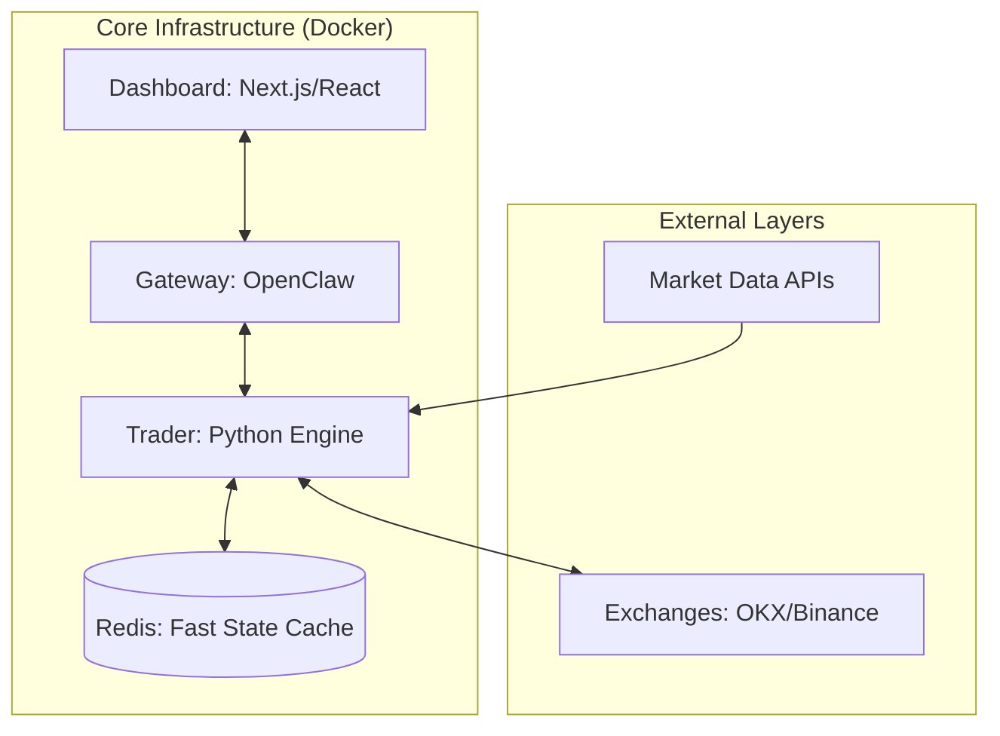

# System Architecture

This document describes the technical architecture of the **AI Agent Traders** ecosystem.

## Installation

1. **Clone the repository**:

   ```bash
   git clone https://github.com/Den3112/AI-Agent-Traders.git
   cd AI-Agent-Traders
   ```

## Overview

AI Agent Traders is built as a distributed, multi-service system designed for high reliability, low latency, and autonomous decision-making.



## Key Components

### 1. Gateway (OpenClaw)

The central orchestrator and communication hub.
- **Technology**: Node.js, OpenClaw Runtime.
- **Role**: Manages agent lifecycles, message routing, and provides the main Chat/API interface.
- **Hardening**: Runs with a non-root user and persistent volumes for agent memory.

### 2. Trader Engine (Python)

The performance-critical intelligence layer.
- **Technology**: Python 3.12, CCXT, Pandas, Redis-py.
- **Monitoring Loop**: `continuous_loop.py` scans markets in parallel using `ThreadPoolExecutor`.
- **TA Engine**: In-process Technical Analysis (RSI, ATR, EMA) to eliminate process startup overhead.
- **State Management**: Uses Redis for atomic, O(1) access to trading state (balance, positions).

### 3. Dashboard

Real-time monitoring and control interface.
- **Technology**: React/Vite.
- **Role**: Visualizes agent activity, market signals, and portfolio status.

### 4. Fast Cache (Redis)

High-performance in-memory store.

- **Role**: Acts as a bridge between the scanner and the agents. Stores live market snapshots and "Paper Trading" state.

## Performance Optimizations

### Dependency Management (uv)

We use `uv` instead of standard `pip` in our Docker builds.

- **Result**: Build times reduced from minutes to seconds.
- **Stability**: Content-addressable cache and strict locking.

### Parallel Market Scanning

The scanner uses a `ThreadPoolExecutor` to query multiple symbols simultaneously.

- **Efficiency**: Reduces scan cycle time by ~80%.

### Container stuck in 'Restarting'

- Check logs: `docker-compose logs <service>`
- Often caused by missing environment variables or Redis being unreachable.

### Slow Market Scan

- Check your internet connection.
- Ensure `CCXT` is using the latest version to avoid API rate-limit issues.

## Risk Management

- **Circuit Breaker**: Automatic kill-switch if portfolio value drops below a set limit.
- **Volatility Filter**: Suspends execution during extreme market volatility (Flash Crash protection).
- **Dynamic SL/TP**: ATR-based exit strategy adapts to market "noise".
